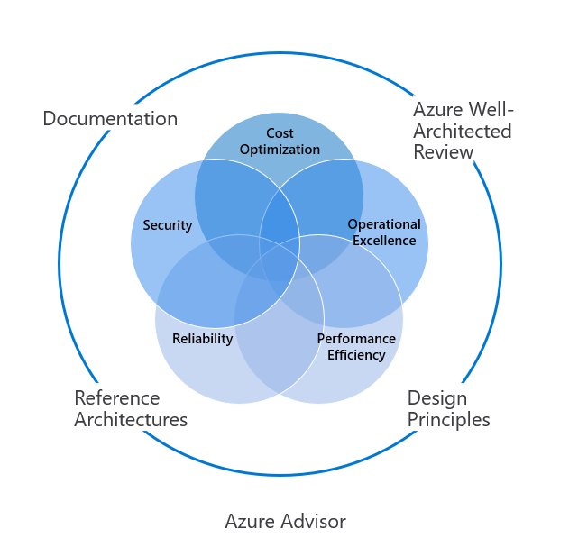

## WEEK 6 LES 1- Governance Frameworks

### Inleiding: wat is dit voor framework?
Voor deze opdracht heb ik gekozen voor het _Microsoft Azure Well-Architected Framework_. Dit framework is een verzameling aan richtlijnen die ingezet kunnen worden om de kwaliteit van workloads in de cloud te verbeteren. Het framework bestaat uit vijf pilaren (pillars of excellence)

* Cost optimization
* Operational excellence
* Performance Efficiency
* Reliability 
* Security

Door een Azure omgeving langs deze pilaren te leggen kunnen er veranderingen gemaakt worden aan de omgeving om deze beter aan te laten sluiten op bedrijfsdoelstellingen. Organisaties die werken met Azure kunnen het framework beschouwen als een handleiding om hun bedrijfsdoelstellingen te laten slagen.

Door kosten te optimaliseren voorkomen organisaties dat ze teveel geld kwijt zijn aan hun omgeving. Het gaat er hierbij specifiek om dat het budget dat beschikbaar is voor een cloud omgeving zo optimaal mogelijk gebruikt wordt. Hierbij schrijft het framework voor dat de focus al in een vroeg stadium op _incremental value_ moet liggen. In het kort houdt dit in dat omgevingen schaalbaar en flexibel moeten zijn om te voorkomen dat er (te) vroeg in het proces grote bedragen uitgegeven worden aan cloud oplossingen. 

De Build-Measure-Learn principes dragen ook bij aan kostenoptimalisatie. Deze principes kunnen ingezet worden om systemen iteratief uit te rollen, op basis van tussentijdse metingen. Ook raadt het framework de pay-to-go strategie aan waarbij je betaalt op basis van je gebruik in de cloud. Tot slot wordt er aangeraden om de _cost calculator_ te gebruiken om kosten te berekenen. In combinatie met deze tool kunnen er budgetten opgesteld worden om zo kosten inzichtelijk en beheersbaar te maken.

De volgende pillar, _operational excellence_, is in het leven geroepen om standaarden te definiëren die bijdragen bij het draaiende houden van applicaties. Hier raadt Microsoft zijn gebruikers aan om deployments betrouwbaar en voorspelbaar te houden. Bovendien kan automatisering ingezet worden om de kans op menselijke fouten te beperken. Tot slot is het belangrijk dat omgevingen gemakkelijk terug gerold kunnen worden wanneer er fouten optreden.

Efficiënte schaling van workloads zodat deze kunnen voldoen aan de vraag van de gebruikers is wat Microsoft _performance efficiency_ noemt. In deze pilaar komen services aan bod die scaling ondersteunen, waarbij een onderscheid gemaakt wordt tussen horizontaal schalen en verticaal schalen. Verticaal schalen is schalen door het toevoegen van resource aan bestaande nodes. Horizontaal schalen, wat de voorkeur geniet, is het toevoegen van nodes aan de workload. 
De Reliability pilaar beschrijft richtlijnen voor het betrouwbaar maken van workloads. Hierbij zijn _resilience_ (veerkracht, een workload moet tegen een stootje kunnen) en _availability_ (een workload moet beschikbaar zijn wanneer gebruikers deze nodig hebben). Aan deze eisen kan een workload voldoen door bijvoorbeeld een failover locatie in te stellen of met behulp van een goede back-up-strategie. Hierbij is goede monitoring van groot belang. 

De laatste pillar is security. Hier stelt Microsoft richtlijnen op die de beveiliging van omgevingen in de cloud moeten verhogen. Dit kan bijvoorbeeld met behulp van identity management in combinatie met Azure AD. Zo kun je domeinen instellen voor gebruik in Azure om zo de toegang te beheren. Ook worden er aanbevelingen gedaan over de beveiliging van applicaties en infrastructuur. 

Hoe draagt dit framework bij aan governance van cloud processen, componenten, services, business en de mensen die er mee werken?
Dit framework draagt bij aan cloud governance door duidelijke handvatten (de pilaren) op te stellen met daarin aanbevelingen om workloads optimaal gebruik te laten maken van de voordelen van het werken in de cloud. De richtlijnen zijn praktisch van aard zodat beheerders er meteen mee aan de slag kunnen. Het heeft een focus op het behalen van bedrijfsdoelstellingen.

Met behulp van het Well Architected Framework kunnen organisaties er voor zorgen dat ze het maximale uit de cloud halen, op een veilige en efficiënte manier. Er is behoefte aan een dergelijk framework omdat veel organisaties worstelen met het migreren van de cloud. Het werken in de cloud is een grote verandering ten opzichte van het ‘ouderwets’ beheren van IT systemen en processen.

### Compleetheid
Het Well Architected Framework is compleet in het beschrijven van de best practices die gelden in het gebruik van Microsoft Azure. Het framework is natuurlijk constant in ontwikkeling. Het kan dus zijn dat het nog niet aangepast is op de nieuwste innovaties in het cloud landschap. Ook gaat het vooral om algemene richtlijnen. Heel diep in de details gaat het niet. Het is dus de verantwoordelijkheid van organisaties om de richtlijnen goed te interpreteren.

### Sterke punten en zwakke punten
De sterke punten van dit framework zijn de toepasbaarheid in de praktijk. Organisaties kunnen direct aan de slag na het lezen van het framework. Een nadeel is de algemene formulering van de pilaren. Omdat er niet diep op details ingegaan wordt, ligt de verantwoordelijkheid bij de organisaties zelf om de best practices correct toe te passen. 

### Grote public cloud providers en het Azure Well Architected Framework

Deze standaard wordt gebruikt door Microsoft. Andere cloud providers, zoals Google en Amazon, maken gebruik van vergelijkbare frameworks. Qua belangrijkste punten zijn de frameworks het eens met elkaar. Verschillen zitten vooral in de services die ingezet kunnen worden om te kunnen voldoen aan best practices. 

Microsoft staat bekend om het zelf gebruiken van Azure voor hun eigen workloads. Dit verschijnsel, dat _dogfooding_ heet, zorgt er voor dat de teams die werken aan Azure precies weten wat tekortkomingen zijn van het cloud platform. Andere cloud providers zullen volgens een zelfde soort principe werken. Bovendien wordt het framework en de cloud omgeving zelf constant aangepast op basis van de wens van (grote) organisaties. Op deze manier probeert Microsoft het framework up-to-date en relevant te houden. 

### Bronnen
* Microsoft. (2019a, september 27). Innovation in the digital economy - Cloud Adoption Framework. Microsoft Docs. https://docs.microsoft.com/en-us/azure/cloud-adoption-framework/innovate/considerations/
Verwijzing in de tekst
* Microsoft. (2019b, november 20). Microsoft Azure Well-Architected Framework - Microsoft Azure Well-Architected Framework introduction. Microsoft Docs. https://docs.microsoft.com/en-us/azure/architecture/framework/
* Stalcup, K. (2020, 15 september). The Azure Well-Architected Review is Worth Your Time. ParkMyCloud. https://www.parkmycloud.com/blog/azure-well-architected/
* Wikipedia contributors. (2021, 16 januari). Eating your own dog food. Wikipedia. https://en.wikipedia.org/wiki/Eating_your_own_dog_food
